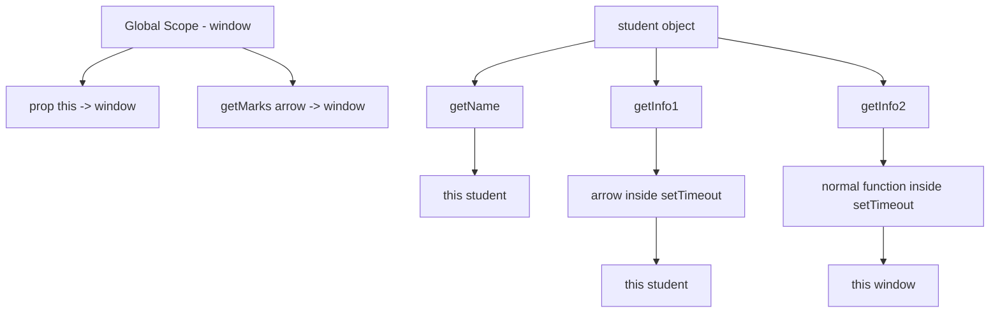

# Understanding `this` with Arrow Functions

## Overview

You created an object:

```js
const student = { ... }
```

It has:
- *Data* → `name`, `marks`
- *Functions* → `getName`, `getMarks`, `getInfo1`, `getInfo2`

## 1. `prop: this`

```js
prop: this
```

This runs when the object is being created

✔ At that time, `this` = global object

- Browser → `window`
- Node → `{}`

So:

```js
student.prop === window // (in browser)
```

## 2. `getName` (Normal Function)

```js
getName: function() {
    console.log(this);
    return this.name;
}
```

When you call:

```js
student.getName();
```

✔ `this` = `student` (because student is calling it)

✔ Output:

```js
{ name: 'Sachin', marks: 80, ... }
Sachin
```

## 3. `getMarks` (Arrow Function)

```js
getMarks: () => {
    console.log(this);
    return this.marks;
}
```

Arrow function *does NOT have its own* `this`

It takes `this` from *parent (global scope)*

✔ So:

- `this` = `window`
- `window.marks` = `undefined`

Result:

```js
student.getMarks(); // undefined
```

##  4. `getInfo1` *(Arrow inside Normal Function )*

```js
getInfo1: function() {
    setTimeout(() => {
        console.log(this);
    }, 2000);
}
```

Step-by-step:

- `student.getInfo1()` → `this = student`
- Arrow function inside → *inherits this*

✔ So after 2 sec:

```js
{ name: 'Sachin', marks: 80, ... }
```

## 5. `getInfo2` *(Normal function inside )*

```js
getInfo2: function() {
    setTimeout(function() {
        console.log(this);
    }, 2000);
}
```

👉 Step-by-step:

- `student.getInfo2()` → `this = student`
- BUT inside `setTimeout` → `normal function`

So:

- `this` becomes *global object (window)*

✔ Output:

```js
window
```

## `this` Flow Diagram

